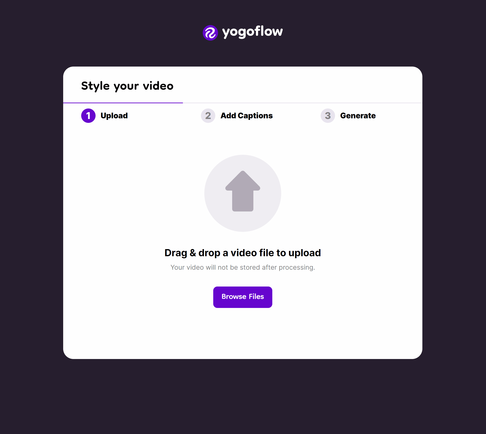

# yogoflow

Easily create tasteful yoga videos in minutes with yogoflow. Yogoflow automatically classifies and annotates sections of your video
with the appropriate yoga move.



## Local Development:

#### Frontend:

Create the following .env:

```
VITE_APII_URL="http://127.0.0.1:5000"
```

Run the dev server like this:

```
cd web
npm install
npm run dev
```

#### Server:

Create the following .env:

```
ROBOFLOW_API_KEY=<your roboflow key>
```

Run the dev server like this:

```
cd server
pip install -r requirements.txt
make dev
```

Run the tests:

```
cd server
make test
```

If you want to deploy on a real server, run it with gunicorn like so:

```
cd server
make run
```
